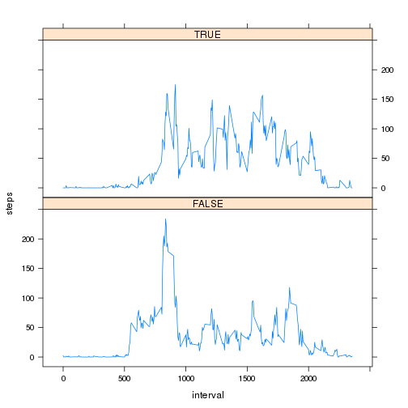

# Reproducible Research: Peer Assessment 1


## Loading and preprocessing the dataa

The working directory is supposed to be the source file location.


```r
unzip('./activity.zip')
data <- read.csv('./activity.csv', colClasses = c('integer', 'Date', 'integer'))
```


## What is mean total number of steps taken per day?

NA values are not removed when calculating the total (sum) number of steps per
day as the days with NA values excluded resulted always in 0 sum and, therefore,
the histogram, mean and median were altered significantly.


```r
steps_day <- tapply(data$steps, data$date, sum)
hist(steps_day, breaks = 8, main = 'Steps per day', xlab = 'Steps')
```

 

```r
mean <- mean(steps_day, na.rm = TRUE)
median <- median(steps_day, na.rm = TRUE)
# Results are embedded just bellow in text
```

The mean total number of steps per day is **1.0766 &times; 10<sup>4</sup>** and the median is
**10765**.


## What is the average daily activity pattern?

This time NA values are excluded when calculating the mean accross all the
intervals.


```r
steps_int <- aggregate(data$steps, by = list(i = data$interval),
                       mean, na.rm = TRUE)
plot(steps_int$i, steps_int$x, type = 'l',
     main = 'Steps per 5-minute interval',
     xlab = 'Interval',
     ylab = 'Average steps taken')
```

 

```r
max_index <- which.max(steps_int[, 'x'])
interval <- steps_int$i[max_index]
# Results are embedded just bellow in text
```

The 5-minute interval which, on average, contains the maximum number of steps is
the **835** interval.


## Imputing missing values

Calculating the total number of NAs can be done in many different ways. Here
is calculated using the vector which contains their indexes in the data frame,
as those values will be used later.


```r
na_index <- which(is.na(data))
n_na <- length(na_index)
```

The the total number of missing values in the dataset is **2304**.

Missing data will be replaced in a new data frame with the mean of the
corresponding 5-minute interval. Although a for loop is not the R style...
some times is just simpler (notice $steps\_int$ was previously calculated):


```r
data2 <- data
for (i in na_index) {
	data2[i, 'steps'] <- steps_int[steps_int$i == data2[i, 'interval'], 'x']
}
```

Analyzing the new data frame with no missing values:


```r
steps_day2 <- tapply(data2$steps, data2$date, sum)
hist(steps_day2, breaks = 8, main = 'Steps per day 2', xlab = 'Steps')
```

 

```r
mean2 <- mean(steps_day2, na.rm = TRUE)
median2 <- median(steps_day2, na.rm = TRUE)
# Results are embedded just bellow in text
```

The mean total number of steps per day is **1.0766 &times; 10<sup>4</sup>** and the median is
**1.0766 &times; 10<sup>4</sup>**. These values do not differ from those calculated in the first
part of the assigment. The only change is in the frequency (the estimates of the
total daily number of steps), as now there are more days with a total number
of steps equal to the mean, and therefore, the middle bar/frequency has a big
peak in the histogram (the other bars are unnaltered).


## Are there differences in activity patterns between weekdays and weekends?

A new column will be added to $data2$ to represent if that day is Saturday or
Sunday (weekend day):


```r
data$iswe <- weekdays(data$date) %in% c('Saturday', 'Sunday')
```

Plotting the data:


```r
library(lattice)
# Weekends
steps_int_we <- aggregate(data[data$iswe, ]$steps,
                          by = list(i = data[data$iswe, ]$interval),
                          mean, na.rm = TRUE)
steps_int_we$iswe <- rep(factor('weekend'), length(steps_int_we))
# Weekdays
steps_int_wd <- aggregate(data[!data$iswe, ]$steps,
                          by = list(i = data[!data$iswe, ]$interval),
                          mean, na.rm = TRUE)
steps_int_wd$iswe <- rep(factor('weekday'), length(steps_int_wd))
# Merge data
steps_int_iswe <- merge(steps_int_we, steps_int_wd, all = TRUE)
# Plot data
xyplot(x ~ i | iswe, steps_int_iswe, type = 'l', xlab = 'Interval',
       ylab = 'Number of steps')
```

 

There are some differences between weekends and weekdays: during weekends, the
number of steps is more constant during all day (excluding sleeping hours),
while the rest of the days, the number of steps tend to be lower except for
peaks at rush hours. The main peak is in the morning, probably before going to
work, which may show that people are in general more motivated (less tired) to
walk than in the afternoon when going back home.

Thanks for taking the time to read this and excuse any language mistakes, which
I bet may make the reading more difficult. :-)

